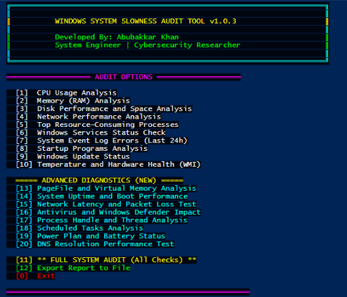

<div align="center">

# 🔍 Windows Server Audit Tool

### Professional-Grade Performance Diagnostics & System Health Analysis

[](https://github.com/PowerShell/PowerShell)
[](https://www.microsoft.com/windows)
[](LICENSE)
[](https://github.com/yourusername/system-audit-tool/releases)
[](https://github.com/yourusername/system-audit-tool)
[](https://github.com/yourusername/system-audit-tool)
[](https://github.com/yourusername)
[](https://github.com/yourusername/system-audit-tool/pulls)

[Features](#-features) • [Installation](#-installation) • [How to Run](#-how-to-run-this-script) • [Usage](#-usage) • [Documentation](#-documentation) • [Contributing](#-contributing)



</div>

---

## 📋 Table of Contents

- [Overview](#-overview)
- [Key Features](#-key-features)
- [System Requirements](#-system-requirements)
- [Installation](#-installation)
- [How to Run This Script](#-how-to-run-this-script)
- [Quick Start](#-quick-start)
- [Usage Guide](#-usage-guide)
- [Feature Documentation](#-feature-documentation)
- [Performance Thresholds](#-performance-thresholds)
- [Output Examples](#-output-examples)
- [Troubleshooting](#-troubleshooting)
- [Contributing](#-contributing)
- [Roadmap](#-roadmap)
- [License](#-license)
- [Authors & Contributors](#-authors--contributors)
- [Acknowledgments](#-acknowledgments)

---

## 🌟 Overview

**Windows Audit Tool** is an advanced, enterprise-grade PowerShell diagnostic utility designed for System Engineers, DevOps professionals, and IT administrators. It provides comprehensive real-time system health analysis, performance bottleneck identification, and detailed slowness diagnostics across Windows servers, workstations, and laptops.

Built with production environments in mind, this tool offers **non-invasive, read-only** system inspection with **zero dependency requirements** and **instant deployment capability**.

### 🎯 Purpose

- **Rapid Diagnosis**: Identify performance bottlenecks in minutes, not hours
- **Production-Safe**: All operations are read-only with comprehensive error handling
- **Zero Dependencies**: Pure PowerShell—no additional modules or installations required
- **Cross-Platform**: Works seamlessly on Windows Server 2012+ and Windows 10/11
- **Audit-Ready**: Export comprehensive reports for compliance and documentation

---

## ✨ Key Features

### 🔧 Core Diagnostics (v1.0)

| Feature | Description | Thresholds |
|---------|-------------|------------|
| **CPU Analysis** | Real-time processor utilization, queue length, top consumers | >80% Critical |
| **Memory Profiling** | RAM usage, page faults, memory leaks detection | >90% Critical |
| **Disk I/O** | Read/Write ops, queue length, space analysis | Queue >2 Critical |
| **Network Performance** | Adapter stats, bandwidth, active connections | Real-time metrics |
| **Process Analysis** | Resource hogs, handle counts, thread analysis | Top 15 ranked |
| **Service Health** | Critical service status, auto-start failures | 11 core services |
| **Event Logs** | System/Application errors, last 24 hours | Error tracking |
| **Startup Programs** | Registry + folder analysis, boot impact | >15 items warning |
| **Windows Updates** | Pending updates, last installation, KB tracking | Signature age check |
| **Hardware Health** | Temperature, BIOS, disk health (SMART-like) | >80°C critical |

### 🚀 Advanced Diagnostics (v1.0.3)

| Feature | Description | Key Metrics |
|---------|-------------|-------------|
| **[13] PageFile Analysis** | Virtual memory usage, commit limits, leak detection | >80% usage alert |
| **[14] Boot Performance** | Uptime tracking, boot config, shutdown history | 30+ days notice |
| **[15] Network Latency** | Packet loss, latency tests (Google/CF/Gateway) | >5% loss critical |
| **[16] Antivirus Impact** | Defender status, 3rd-party AV detection, resource usage | Signature age |
| **[17] Handle Analysis** | Handle leaks, thread exhaustion, system limits | >10K handles |
| **[18] Scheduled Tasks** | Running/failed tasks, execution history | Result code check |
| **[19] Power Plan** | Active scheme, battery health, CPU power settings | Power saver warning |
| **[20] DNS Performance** | Resolution speed, cache stats, server tests | >100ms slow |

### 📊 Additional Capabilities

- ✅ **Full System Audit**: Run all 18 checks in one operation
- 📁 **Export Reports**: Timestamped TXT reports to Desktop
- 🎨 **Color-Coded Alerts**: Visual indicators (Green/Yellow/Red)
- 🔄 **Menu-Driven Interface**: Easy navigation for all skill levels
- 📈 **Performance Counters**: Real-time WMI/Performance Monitor integration
- 🛡️ **Production-Safe**: Non-destructive, read-only operations

---

## 💻 System Requirements

### Minimum Requirements

- **Operating System**: Windows Server 2012 R2+ or Windows 10+
- **PowerShell**: Version 5.1 or higher (pre-installed on modern Windows)
- **Permissions**: Administrator rights (required for full diagnostics)
- **Architecture**: x64/x86 compatible

### Tested Environments

| Platform | Version | Status |
|----------|---------|--------|
| Windows Server 2022 | 21H2 | ✅ Fully Tested |
| Windows Server 2019 | 1809 | ✅ Fully Tested |
| Windows Server 2016 | 1607 | ✅ Fully Tested |
| Windows 11 | 22H2/23H2 | ✅ Fully Tested |
| Windows 10 | 21H2/22H2 | ✅ Fully Tested |
| Windows Server 2012 R2 | 9600 | ⚠️ Limited Testing |

### Optional Components

- **WMI/CIM**: Enabled (for hardware health checks)
- **Performance Counters**: Enabled (for CPU/Memory/Disk metrics)
- **Event Logs**: Accessible (for error analysis)

---

## 🚀 Installation

### Method 1: Git Clone (Recommended)

```
# Clone the repository
git clone https://github.com/yourusername/system-audit-tool.git

# Navigate to directory
cd system-audit-tool
```

### Method 2: Direct Download

1. Click the **[Download ZIP]** button at the top of this page
2. Extract the ZIP file to your desired location (e.g., `C:\Tools\SystemAudit`)
3. Navigate to the extracted folder

### Method 3: Manual Download

1. Download `system_audit.ps1` from the [Releases](https://github.com/yourusername/system-audit-tool/releases) page
2. Save to a folder of your choice

---

## 🎯 How to Run This Script

### Step-by-Step Execution Guide

#### **Option 1: Run from PowerShell (Recommended)**

**Step 1: Open PowerShell as Administrator**

- Press `Windows Key + X`
- Select **"Windows PowerShell (Admin)"** or **"Terminal (Admin)"**
- Or: Search for **PowerShell** → Right-click → **"Run as Administrator"**

**Step 2: Set Execution Policy (First Time Only)**

```
# Allow script execution for this session only (safest)
Set-ExecutionPolicy -ExecutionPolicy Bypass -Scope Process -Force
```

> **Note**: This is temporary and only affects the current PowerShell session. It resets when you close PowerShell.

**Step 3: Navigate to Script Directory**

```
# Example: Navigate to Desktop
cd C:\Users\YourUsername\Desktop\SystemAudit

# Or use the full path directly
cd "C:\Path\To\system-audit-tool"
```

**Step 4: Run the Script**

```
# Execute the script
.\system_audit.ps1
```

**That's it! The menu will appear automatically.**

---

#### **Option 2: Run from Command Prompt (CMD)**

**Step 1: Open Command Prompt as Administrator**

- Press `Windows Key + X`
- Select **"Command Prompt (Admin)"**
- Or: Search for **CMD** → Right-click → **"Run as Administrator"**

**Step 2: Navigate to Script Location**

```
cd C:\Users\YourUsername\Desktop\SystemAudit
```

**Step 3: Execute via PowerShell**

```
powershell -ExecutionPolicy Bypass -File ".\system_audit.ps1"
```

---

#### **Option 3: Right-Click Execution (Windows Explorer)**

**Step 1: Prepare Script (One-Time Setup)**

Create a batch file named `RUN_AS_ADMIN.bat` in the same folder:

```
@echo off
powershell -ExecutionPolicy Bypass -File "%~dp0system_audit.ps1"
pause
```

**Step 2: Run**

- Right-click `RUN_AS_ADMIN.bat`
- Select **"Run as Administrator"**

---

#### **Option 4: Direct Double-Click (Advanced - Requires Policy Change)**

⚠️ **Warning**: This permanently changes your system's execution policy.

```
# Run once as Administrator
Set-ExecutionPolicy -ExecutionPolicy RemoteSigned -Scope CurrentUser
```

After this, you can double-click `system_audit.ps1` to run it.

---

### Visual Execution Flow

```
┌─────────────────────────────────────┐
│  1. Right-click PowerShell          │
│     → Run as Administrator          │
└──────────────┬──────────────────────┘
               │
               ▼
┌─────────────────────────────────────┐
│  2. Set Execution Policy            │
│     Set-ExecutionPolicy Bypass...   │
└──────────────┬──────────────────────┘
               │
               ▼
┌─────────────────────────────────────┐
│  3. Navigate to Script              │
│     cd C:\Path\To\Script            │
└──────────────┬──────────────────────┘
               │
               ▼
┌─────────────────────────────────────┐
│  4. Run Script                      │
│     .\system_audit.ps1              │
└──────────────┬──────────────────────┘
               │
               ▼
┌─────────────────────────────────────┐
│  ✅ Menu Appears - Select Option    │
└─────────────────────────────────────┘
```

---

## ⚡ Quick Start

### Complete Example Session

```
# Step 1: Open PowerShell as Administrator
# (Use Windows Key + X → Windows PowerShell (Admin))

# Step 2: Navigate to script location
cd C:\Users\YourName\Desktop\SystemAudit

# Step 3: Set execution policy (first time only)
Set-ExecutionPolicy -ExecutionPolicy Bypass -Scope Process -Force

# Step 4: Run the script
.\system_audit.ps1

# Step 5: Select option from menu
# Example: Press  for Full System Audit[11]
# Then press  to Export Report[12]
```

---

## 📖 Usage Guide

### Interactive Menu Navigation

Once the script runs, you'll see this menu:

```
╔═══════════════════════════════════════════════════════════════════════╗
║                                                                       ║
║          WINDOWS SYSTEM SLOWNESS AUDIT TOOL v1.0.3                    ║
║                                                                       ║
║          Developed By: Abubakkar Khan                                 ║
║          System Engineer | Cybersecurity Researcher                   ║
║                                                                       ║
╚═══════════════════════════════════════════════════════════════════════╝

═══════════════════ AUDIT OPTIONS ═══════════════════

    CPU Usage Analysis[13]
    Memory (RAM) Analysis[14]
    Disk Performance and Space Analysis[15]
    Network Performance Analysis[16]
    Top Resource-Consuming Processes[17]
    Windows Services Status Check[18]
    System Event Log Errors (Last 24h)[19]
    Startup Programs Analysis[20]
    Windows Update Status[21]
   Temperature and Hardware Health (WMI)[22]

  ===== ADVANCED DIAGNOSTICS =====
   PageFile and Virtual Memory Analysis[23]
   System Uptime and Boot Performance[24]
   Network Latency and Packet Loss Test[25]
   Antivirus and Windows Defender Impact[26]
   Process Handle and Thread Analysis[27]
   Scheduled Tasks Analysis[28]
   Power Plan and Battery Status[29]
   DNS Resolution Performance Test[30]

   ** FULL SYSTEM AUDIT (All Checks) **[11]
   Export Report to File[12]
    Exit

Select an option (0-20): _
```

### Common Workflows

**🔍 Quick Health Check**
```
1. Select  → Full System Audit[11]
2. Review all diagnostics in one go
3. Color-coded results (Green/Yellow/Red)
```

**📄 Generate Report for Management**
```
1. Select  → Export Report to File[12]
2. File saved to Desktop: SystemAudit_20251111_123045.txt
3. Send report via email or document management system
```

**🐛 Troubleshoot Specific Slowness**
```
1. Select  → CPU Analysis (check for high usage)[13]
2. Select  → Memory Analysis (check for leaks)[14]
3. Select  → Disk I/O (check for bottlenecks)[15]
4. Select  → Event Logs (check for errors)[19]
```

**🌐 Network Issues**
```
1. Select  → Network Latency Test[25]
2. Select  → DNS Performance Test[30]
3. Select  → Network Performance Analysis[16]
```

---

## 📚 Feature Documentation

### Core Features Breakdown

#### [1] CPU Usage Analysis
**What it checks:**
- Current CPU load percentage
- CPU queue length (indicates bottleneck)
- Top 10 CPU-consuming processes
- CPU specs: model, cores, threads, clock speed

**Thresholds:**
- 🟢 Normal: <60%
- 🟡 Warning: 60-80%
- 🔴 Critical: >80%

**Example Output:**
```
[+] CPU USAGE ANALYSIS
CPU Model      : Intel(R) Core(TM) i7-9700K CPU @ 3.60GHz
Current Load   : 34.52% [GREEN]
CPU Queue Len  : 0.85 [GREEN]

Top 10 CPU-Consuming Processes:
ProcessName          CPU      Id
-----------          ---      --
chrome             125.43  12345
```

---

#### [13] PageFile Analysis
**What it checks:**
- PageFile location and size
- Current usage vs. allocated
- Virtual memory commit limits

**Action if critical:**
1. Increase PageFile size
2. Add more physical RAM
3. Check for memory leaks

---

#### [15] Network Latency Test
**What it checks:**
- Pings Google DNS (8.8.8.8), Cloudflare (1.1.1.1), and local gateway
- 10-packet test with min/avg/max latency
- Packet loss percentage

**Thresholds:**
- 🟢 Good: <50ms, <1% loss
- 🟡 Warning: 50-100ms, 1-5% loss
- 🔴 Critical: >100ms, >5% loss

---

## 📊 Performance Thresholds

### System Health Matrix

| Component | Normal | Warning | Critical | Action Required |
|-----------|--------|---------|----------|-----------------|
| **CPU Load** | <60% | 60-80% | >80% | Terminate processes |
| **CPU Queue** | <2 | 2-5 | >5 | CPU bottleneck |
| **RAM Usage** | <75% | 75-90% | >90% | Add RAM/find leaks |
| **Disk Space** | >20% free | 10-20% free | <10% free | Free up space |
| **Disk Queue** | <1 | 1-2 | >2 | I/O bottleneck |
| **PageFile** | <60% | 60-80% | >80% | Increase size |
| **Packet Loss** | <1% | 1-5% | >5% | Network issue |
| **Latency** | <50ms | 50-100ms | >100ms | Network degraded |
| **DNS Resolution** | <50ms | 50-100ms | >100ms | Change DNS |
| **Temperature** | <70°C | 70-80°C | >80°C | Cooling issue |

---

## 📸 Output Examples

### CPU Analysis Output
```
[+] CPU USAGE ANALYSIS
━━━━━━━━━━━━━━━━━━━━━━━━━━━━━━━━━━━━━━━━━━━━━━━━━━━━
CPU Model      : Intel(R) Core(TM) i7-9700K CPU @ 3.60GHz
Cores/Threads  : 8 Cores / 8 Logical Processors
Current Load   : 34.52% [GREEN]
Max Clock Speed: 3600 MHz
Current Speed  : 3600 MHz
CPU Queue Len  : 0.85 [GREEN]

Top 10 CPU-Consuming Processes:
ProcessName          CPU      Id
-----------          ---      --
chrome             125.43  12345
sqlservr            89.22   4567
powershell          12.34   8901

[OK] CPU usage is within normal range
```

### Network Latency Test Output
```
[+] NETWORK LATENCY AND PACKET LOSS TEST
━━━━━━━━━━━━━━━━━━━━━━━━━━━━━━━━━━━━━━━━━━━━━━━━━━━━

Testing: Google DNS (8.8.8.8)
Packets Sent   : 10
Packets Recv   : 10 [GREEN]
Packet Loss    : 0% [GREEN]
Min Latency    : 12 ms
Avg Latency    : 15.43 ms [GREEN]
Max Latency    : 23 ms
```

---

## 🔧 Troubleshooting

### Common Errors & Solutions

#### ❌ "Execution Policy Restriction"

**Error Message:**
```
.\system_audit.ps1 : File cannot be loaded because running scripts is disabled on this system.
```

**Solution:**
```
Set-ExecutionPolicy -ExecutionPolicy Bypass -Scope Process -Force
```

---

#### ❌ "Access Denied"

**Error Message:**
```
Access to the path is denied.
```

**Solution:**
- Right-click PowerShell → **Run as Administrator**
- Ensure you have local admin rights

---

#### ❌ "Get-Counter: The data is not valid"

**Solution:**
```
# Run in Command Prompt as Admin
lodctr /r
# Then reboot
```

---

#### ❌ "WMI/CIM Instance Not Found"

**Solution:**
```
# Check WMI repository
winmgmt /verifyrepository

# If broken, repair it
winmgmt /salvagerepository
```

---

#### ❌ Script Runs but Menu Doesn't Appear

**Solution:**
1. Check PowerShell version: `$PSVersionTable.PSVersion` (must be 5.1+)
2. Run in a new PowerShell window
3. Check for syntax errors with: `powershell -NoExit -File .\system_audit.ps1`

---

## 🤝 Contributing

Contributions are **welcome and encouraged**! Here's how:

### How to Contribute

1. **Fork** the repository
2. **Create** a feature branch: `git checkout -b feature/AmazingFeature`
3. **Commit** changes: `git commit -m 'Add AmazingFeature'`
4. **Push** to branch: `git push origin feature/AmazingFeature`
5. **Open** a Pull Request

### Development Guidelines

- Follow PowerShell best practices (PSScriptAnalyzer)
- Test on Windows Server and Desktop
- Add comments for complex logic
- Update README.md for new features

### Reporting Issues

Found a bug? [Open an issue](https://github.com/yourusername/system-audit-tool/issues/new) with:

- OS Version
- PowerShell Version
- Error Message
- Steps to Reproduce

---

## 🗺️ Roadmap

### v1.1 (Planned)

- [ ] Remote system support via WinRM
- [ ] JSON/CSV export formats
- [ ] HTML dashboard reports
- [ ] Email alert integration

### v2.0 (Future)

- [ ] Cloud integration (Azure/AWS)
- [ ] Grafana/Prometheus integration
- [ ] AI-powered anomaly detection
- [ ] Multi-language support

---

## 📄 License

This project is licensed under the **MIT License** - see the [LICENSE](LICENSE) file for details.

### MIT License Summary

```
Copyright (c) 2025 Abubakkar Khan

Permission is hereby granted, free of charge, to any person obtaining a copy
of this software and associated documentation files (the "Software"), to deal
in the Software without restriction, including without limitation the rights
to use, copy, modify, merge, publish, distribute, sublicense, and/or sell
copies of the Software, and to permit persons to whom the Software is
furnished to do so, subject to the following conditions...
```

**TL;DR**: Free to use, modify, and distribute. No warranties provided.

---

## 👥 Authors & Contributors

### **Maintained by:** Abubakkar Khan

**Lead Developer & Architect:**
- **Abubakkar Khan**  
  *System Engineer | Cybersecurity Researcher*  
  - 🌐 Portfolio: [yourwebsite.com](https://yourwebsite.com)
  - 💼 LinkedIn: [linkedin.com/in/abubakkar](https://linkedin.com/in/yourusername)
  - 📧 Email: abubakkar@example.com
  - 🐦 Twitter: [@yourusername](https://twitter.com/yourusername)

### **Development Team:**
- **SCT DevOps & Infrastructure Team**
  - Infrastructure Engineering
  - Performance Optimization
  - Security Hardening

### **Special Thanks:**
- Beta testers and early adopters
- Open-source community contributors
- Microsoft PowerShell documentation team

---

## 🙏 Acknowledgments

Special thanks to:

- **Microsoft** for PowerShell and comprehensive documentation
- **SCT DevOps Team** for production testing and feedback
- **System Administrator Community** for feature requests
- **Open Source Contributors** worldwide

### Built With

- [PowerShell 5.1+](https://github.com/PowerShell/PowerShell)
- [WMI/CIM](https://docs.microsoft.com/en-us/windows/win32/wmisdk/wmi-start-page)
- [Performance Counters](https://docs.microsoft.com/en-us/windows/win32/perfctrs/performance-counters-portal)
- ☕ Coffee & Dedication

---

## 📞 Support & Community

### Getting Help

- 📖 **Documentation**: [GitHub Wiki](https://github.com/yourusername/system-audit-tool/wiki)
- 💬 **Discussions**: [GitHub Discussions](https://github.com/yourusername/system-audit-tool/discussions)
- 🐛 **Bug Reports**: [Issues](https://github.com/yourusername/system-audit-tool/issues)
- 📧 **Email**: support@yourwebsite.com

### Stay Updated

- 🔔 **Watch** this repository
- ⭐ **Star** if this helped you
- 🔄 **Share** with colleagues

---

## 📈 Project Statistics


---

<div align="center">

### ⭐ If this tool saved you time, please star the repository! ⭐

**Made with ❤️ by [Abubakkar Khan](https://github.com/yourusername) & SCT DevOps Team**

---

**Environment:** Production  
**Last Updated:** November 11, 2025  
**Version:** 1.0.3  
**Status:** ✅ Stable & Production-Ready

[Back to Top](#-windows-system-slowness-audit-tool)

</div>

